<p align="center">
  
</p>

<p align="center">
  
</p>

<p align="center">
  <a href="https://pf-three-pi.vercel.app/">Portfolio</a>
  &nbsp;·&nbsp;
  <a href="https://github.com/ISSEI51?tab=repositories">Repositories</a>
</p>

---

## // ABOUT

I study theoretical physics and build software that has to survive contact with reality.

I take an idea the whole way: requirements, architecture, implementation, deploy, and the 3 a.m. incident.
Backend and cloud are home turf — Django, AWS, queues, containers, CI/CD.
AI is how I move fast, not how I skip understanding; nothing I ship stays a black box to me.

Physics taught me to trust a model only after deriving it. Same rule applies to systems.

## // TECH ARSENAL

**LANGUAGES** &nbsp;    

**BACKEND** &nbsp;    

**FRONTEND** &nbsp;   

**INFRASTRUCTURE** &nbsp;    

**DATA** &nbsp;    

**AI DEVELOPMENT** &nbsp;    

<sub>AWS surface: EC2 · RDS · S3 · ALB · ECS — provisioned, deployed, and kept alive with GitHub Actions pipelines.</sub>

## // FEATURED PROJECTS

**[RaidCoder](https://github.com/ISSEI51/RaidCoder)** — competitive programming as a raid boss

Every Monday an AI generates six ranked problems and a shared boss. Each accepted solution deals damage, and the HP bar drops live on everyone's screen until the week ends. Mine end to end: schema and row-level security, the judging pipeline, the deploy topology.

`Next.js` `TypeScript` `Supabase / PostgreSQL` `Realtime + RLS` `Judge0` `Docker` `Vercel`

**[IsingCompare](https://github.com/ISSEI51/IsingCompare)** — classical vs. quantum, measured

Solves Ising optimization by brute force and simulated annealing, then builds the quantum Hamiltonian and tracks the spectral gap of `H(s) = (1-s)H_d + s·H_p` — the quantity that decides whether quantum annealing wins or stalls.

`Python` `NumPy` `Quantum annealing` `Spectral analysis`

**[algo-practice](https://github.com/ISSEI51/algo-practice)** — algorithms, done properly

A structured curriculum instead of a solution dump: every problem ships a written spec, an implementation, and a test suite that has to pass before it counts.

`Python` `pytest` `Data structures` `Complexity analysis`

<sub>More simulations: <a href="https://github.com/ISSEI51/QAvsSAsimulation">QAvsSAsimulation</a> · <a href="https://github.com/ISSEI51/2Dising">2Dising</a> · <a href="https://github.com/ISSEI51/1Dising">1Dising</a> · <a href="https://github.com/ISSEI51/LorentzSim">LorentzSim</a> &nbsp;|&nbsp; Most of my production work — Django + AWS business systems and AI-assisted development tooling — lives in private repositories.</sub>

## // CURRENT QUEST

```text
╭────────────────────────────────────────────╮
│ CURRENT QUEST                       STATUS │
├────────────────────────────────────────────┤
│ [01] Own every layer, not the vibe  ACTIVE │
│ [02] Design for load, not for demos ACTIVE │
│ [03] Physics + algorithms as tools  ACTIVE │
│ [04] Engineer now, founder next     QUEUED │
╰────────────────────────────────────────────╯
```

## // TELEMETRY

<p align="center">
  
  
</p>

<p align="center">
  
</p>

<p align="center"><sub>Public repositories only — private work is not counted here.</sub></p>

## // CONTRIBUTION TRACE

<p align="center">
  <picture>
    <source media="(prefers-color-scheme: dark)" srcset="https://raw.githubusercontent.com/ISSEI51/ISSEI51/output/github-snake-dark.svg">
    <source media="(prefers-color-scheme: light)" srcset="https://raw.githubusercontent.com/ISSEI51/ISSEI51/output/github-snake.svg">
    
  </picture>
</p>

---

<p align="center">
  
</p>
